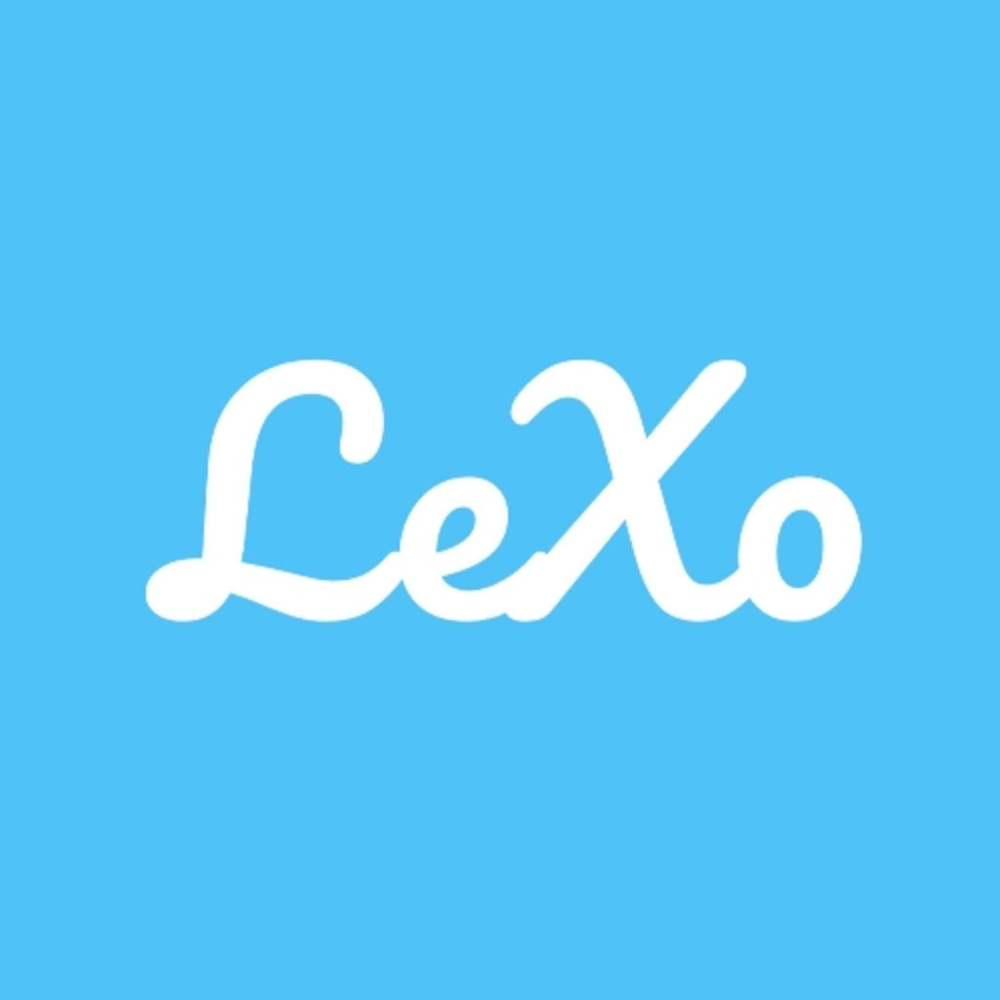

<p align="center">
  
</p>

# LeXo - Premium Wordle Experience

LeXo is a modern, high-polish take on the classic Wordle game, built with Flutter. It combines the addictive logic of word puzzles with a stunning **Aqua Skeuomorphic** design and premium user experience.

## ✨ Features

### 🎮 Multiple Game Modes
- **Daily Wordle**: Join players worldwide in solving a single, unique word every 24 hours.
- **Free Play**: Unlimited practice! Play as many words as you want to sharpen your skills.

### 🎨 Visual Excellence
- **Skeuomorphic Design**: High-fidelity 3D buttons, glossy gradients, and tactile animations that feel premium to the touch.
- **Modern Typography**: Branded with **Pacifico** and **Poppins** Google Fonts for a stylish, clean aesthetic.
- **Dynamic UI**: Smooth transitions and celebratory confetti for your hard-earned victories.

### 📊 Smart Progress Tracking
- **Global Statistics**: A unified tracking system that records your wins, streaks, and guess distribution across all game modes.
- **Progress Visibility**: Access your "Statistiques" and "How to Play" from any screen in the app.

### 💡 Interactive Hints
- **Rewarded Hints**: Need a helping hand? Watch a quick video to reveal a correct letter and its position in the word.

### 💰 Support & Ads
- **Monetization Ready**: Integrated AdMob banners, interstitials, and rewarded ads.
- **Community Support**: Integrated "Buy Me a Coffee" (Ko-fi) link to support the developer directly.

---

## 🛠 Tech Stack

- **Framework**: [Flutter](https://flutter.dev)
- **State Management**: [ChangeNotifier](https://api.flutter.dev/flutter/foundation/ChangeNotifier-class.html)
- **Styling**: [Google Fonts](https://pub.dev/packages/google_fonts) & [Flutter Animate](https://pub.dev/packages/flutter_animate)
- **Monetization**: [Google Mobile Ads SDK](https://pub.dev/packages/google_mobile_ads)
- **Storage**: [SharedPreferences](https://pub.dev/packages/shared_preferences)

---

## 🚀 Getting Started

1. **Clone the repository**:
   ```bash
   git clone https://github.com/Abderridr/lexo-wordle-app.git
   ```

2. **Install dependencies**:
   ```bash
   flutter pub get
   ```

3. **Configure AdMob**:
   Update your `android/app/src/main/AndroidManifest.xml` with your AdMob App ID.

4. **Run the app**:
   ```bash
   flutter run
   ```

---

## ☕ Support Development

If you enjoy playing LeXo, consider supporting the development!

[](https://ko-fi.com/abderridr)

---

## 📝 License

This project is licensed under the MIT License - see the LICENSE file for details.
